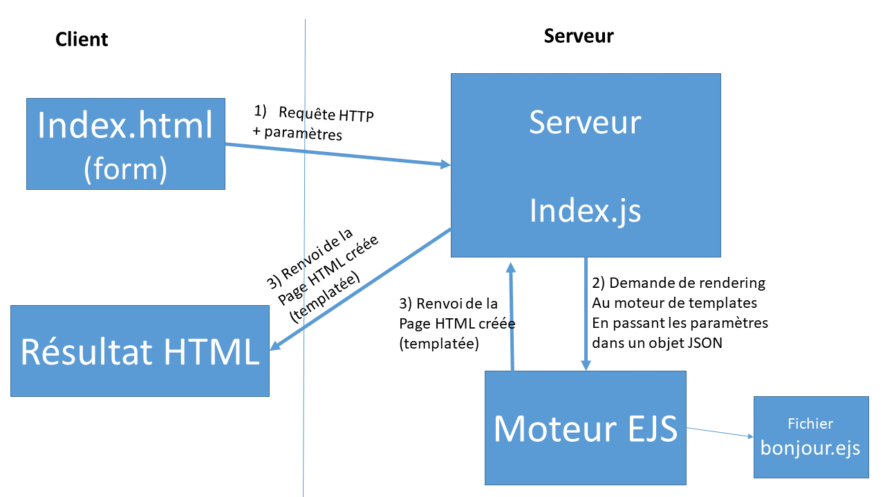

# TP3-NodeJSbis
Suite du cours / TP NodeJS

Retrouvez le code de l'application qu'on a développée ensemble dans la branche [master](https://github.com/INUKA-Web/TP3-NodeJSbis/tree/master) de ce projet.

## Correction de l'exercice du TP précédent

> envoyer les paramètres en POST et non en GET : docs à http://expressjs.com/en/5x/api.html#app.post.method et http://expressjs.com/en/5x/api.html#req.body

- Modifier la page HTML pour qu'elle envoie le formulaire en POST
- dans `index.js`, rajouter 
  - `const bodyParser = require('body-parser')`
  - `app.use(bodyParser.urlencoded({ extended: true }))`
- dans `index.js`, remplacer le traitement de la requête en GET /disbonjour par :
  ```javascript
  app.post('/disbonjour', (req, res) => {
    res.send('Bonjour ' + req.body.personne)
  })
  ```


> faire en sorte que `/disbonjour` renvoie une page HTML (et pas juste du texte) : modifier le contenu de "req.send" en y rajoutant du code HTML

`res.send('<html><body><h1>Bonjour <span style="color:red">' + req.body.personne + '</span></h1></body></html>')`

> faire en sorte d'inclure l'horloge côté client qu'on a faite la semaine dernière dans la réponse de disbonjour :
  - rajouter une balise "script" dans la page HTML
  - servir le fichier de script en question à l'aide de http://expressjs.com/en/5x/api.html#res.sendFile (regarder ce qui a été fait pour servir le fichier index.html).

...

## Templating de pages Web

Utilisation de EJS avec Express



Exemple de tuto : https://www.digitalocean.com/community/tutorials/how-to-use-ejs-to-template-your-node-application-fr

**Préparation :**

1. Installer EJS : `npm i ejs` dans le répertoire de votre projet
2. Définir EJS comme moteur de rendu dans le serveur : ajouter l'instruction `app.set('view engine', 'ejs');` dans le fichier index.js
3. Créer un répertoire `views` dans le répertoire du projet, où vous mettrez les modèles (templates) avec une extension .ejs

**Création d'un template :**

Faire une page Web simple, et l'enregistrer dans `views` avec une extension .ejs

**Association de ce template avec une requête du serveur :**

1. Dans index.js, rajouter un objet JSON dans l'appel du template, avec les données à templater :
  `res.render('bonjour', {personne: req.body.personne})`
2. Dans le template, rajouter une variable qui utilise le nom de la propriété de l'objet JSON pour le placer dans la page HTML :
  `<h1>Bonjour <%= personne %></h1>`

## Single-Page Application

Cours : https://perso.liris.cnrs.fr/lionel.medini/enseignement/M1IF03/CM/4_1_AJAX.pdf

### Objectif du TP

Faire une SPA avec 3 vues :

- Accueil
- La page qui dit bonjour en AJAX
- L'horloge en AJAX

### Préambule : modifications du serveur

Modifier le fichier `index.js` pour lui ajouter :

- Gestion du corps de la requête en JSON : `app.use(express.json())`
- Gestion des fichiers statiques : `app.use('/static', express.static('public'))`

**Rappel** : le serveur doit exposer une route (par exemple `/disbonjour-json`) qui récupère un paramètre avec le com de la personne à qui dire bonjour, et capable de renvoyer un message dans un objet JSON.

### Création de la page principale

- à partir de [cette page](https://perso.liris.cnrs.fr/lionel.medini/enseignement/M1IF03/Tutoriels/exemples/SPA/exemple_SPA.html)
  - la recopier dans un fichier nommé `spa.html`, dans le répertoire `public`
  - on peut requêter cette page sur le serveur par l'URL : http://localhost:3000/static/spa.html

### Modification de la vue 1 pour requêter "disbonjour" en AJAX

- en utilisant le code décrit dans [ce cours](https://perso.liris.cnrs.fr/lionel.medini/enseignement/M1IF03/CM/4_1_AJAX.pdf) (slide 41) pour changer de vue côté client
- en utilisant le code des slides 23 et 24 du même cours pour envoyer une requête asynchrone au serveur et envoyer les données formattées en JSON.
- en modifiant la page HTML de la SPA pour y ajouter un champ texte et un bouton (similaire au formulaire qu'on avait mis dans la page `index.html`)
- en rajoutant un script qui se déclenche quand on clique sur le bouton  et qui envoie la requête avec `fetch()`

Le code fonctionnel pour cette partie est [ici](https://github.com/INUKA-Web/TP3-NodeJSbis/tree/93aba0f99d1b944c68c9d0ba2d4990d24d13d945).

## &Agrave; faire pour la prochaine fois

Sur le même modèle, modifier la vue 2 pour qu'elle affiche l'horloge en requêtant le serveur toutes les secondes et en mettant à jour son affichage.

_Indication_ : le processus est à peu près le même :

- créer une route côté serveur qui renvoie l'heure en JSON
- utiliser la fonction `setInterval()` qu'on a vue à la 2ème séance pour faire des requêtes régulières (pas besoin de formulaire ni de bouton).
- rajouter un élément HTML avec un ID sur la page, et rajouter le contenu de la réponse de la même façon que pour la vue 1.

Amusez-vous bien ;-)...
